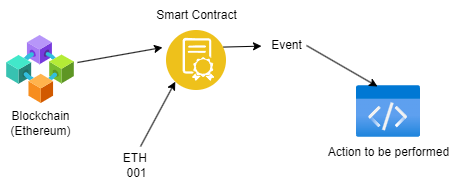

# Web3 Bootcamp Ethereum

Some Jagron we should know:

1. Blockchain
2. Private keys : Seed
3. Wallets : MetaMask
4. RPC : Remote Procedure Call
5. Smart Contracts


**Bitcoin** was the first blockchain. It works as a ledger and was introduced as a secure financial system.\
But, it had limitations.

### ETHEREUM

Ethereum has an edge over BTC as smart contracts can be written on it.


Ethereum is a Core Blockchain
More Tokens can be built on Ethereum Blockchain such as:

- Polygon $MATIC
- Optimism $OP
- ImmutableX IMX

They are basically smart contracts written on ethereum blockchain.

Bank provides its APIs to only reliable platforms such as RazorPay, Stripe
Which can be used to make transaction on other third party platforms such as crypto exchange.

**Decentralized Exchange:**
A contract that lets us exchange fiat for token, token for token, and token for fiat.



## What we need to learn

1. Basic of Solidity Language.
2. Cross Contract Calls
3. Optimizing contracts | Openzeplin
4. Payment in ETH

Follow the structured course on https://cryptozombies.io

---

### Understanding solidity.

```
pragma solidity

contract HelloWorld
```

contract keyword can be mapped to class in C++ and struct in Rust.
